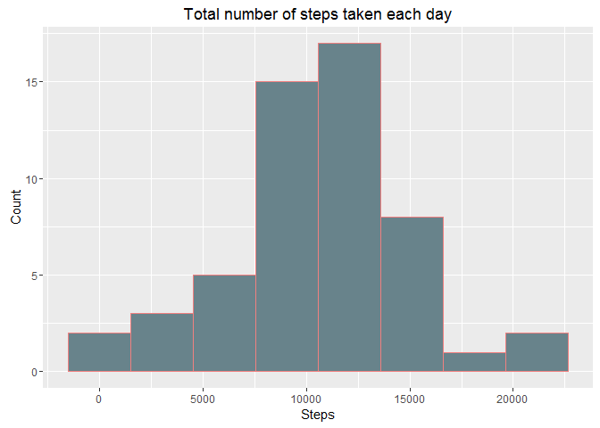
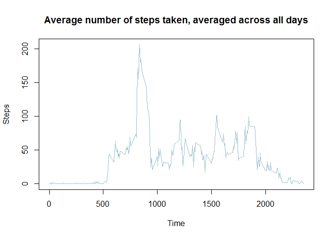
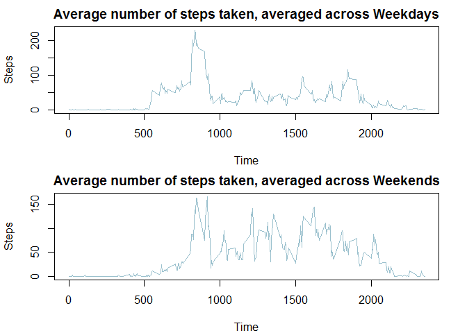

# Reproducible Research, Course Project 1
Jesús Martín García  
2 December 2016  


#### 1. Code for reading in the dataset 


```r
setwd("C:/Users/Jesus/Desktop/R")
fileUrl <- "https://d396qusza40orc.cloudfront.net/repdata%2Fdata%2Factivity.zip"
download.file(fileUrl, destfile = "ActData")
unzip("ActData")
ActData <- read.csv("activity.csv", header = TRUE)
```

#### 2. Histogram of the total number of steps taken each day 


```r
library(ggplot2)
StepsData <- tapply(ActData$steps, ActData$date, sum)
qplot(StepsData, bins = 8, fill = I("lightblue4"), colour = I("lightcoral"), xlab = "Steps", 
      ylab = "Count", main = "Total number of steps taken each day")
```

<!-- -->

#### 3. Mean and median number of steps taken each day 


```r
StepsMean <- mean(StepsData, na.rm = TRUE)
StepsMean
```

```
## [1] 10766.19
```

```r
StepsMedian <- median(StepsData, na.rm = TRUE)
StepsMedian
```

```
## [1] 10765
```

#### 4. Time series plot of the average number of steps taken


```r
ActData2 <- ActData[complete.cases(ActData), ]
StepsbyInterval <- as.data.frame(tapply(ActData2$steps, ActData2$interval, mean))
names(StepsbyInterval) <- c( "AvgSteps")
plot(rownames(StepsbyInterval), StepsbyInterval$AvgSteps, type = "n", xlab = "Time", ylab = "Steps", 
     main = "Average number of steps taken, averaged across all days")
lines(rownames(StepsbyInterval), StepsbyInterval$AvgSteps, col = "lightblue3")
```

<!-- -->

####5. The 5-minute interval that, on average, contains the maximum number of steps


```r
MaximumSteps <- row.names(subset(StepsbyInterval, 
                                 StepsbyInterval[,1] == max(StepsbyInterval[,1])))
MaximumSteps
```

```
## [1] "835"
```

####6. Code to describe and show a strategy for imputing missing data 


```r
Missingcases <- nrow(ActData) - sum(complete.cases(ActData))
Missingcases
```

```
## [1] 2304
```

The strategy used here for inputing missing data will fill the NA values with the mean of 
steps taken in that particular interval where the data is missing. For example if a data is 
missing in the 300 interval, the inputed value will be the mean of the rest of the values in
the 300 interval where the data is not missing.


```r
meanbyint <- as.data.frame(tapply(ActData2$steps, ActData2$interval, mean))
names(meanbyint) <- "avgsteps"
ActData3 <- ActData
ActData3[complete.cases(ActData3) == FALSE,1] <- sapply(meanbyint, rep.int, times=8)
```

####7. Histogram of the total number of steps taken each day after missing values are imputed


```r
StepsData2 <- tapply(ActData3$steps, ActData3$date, sum)
qplot(StepsData2, bins = 8, fill = I("lightblue4"), colour = I("lightcoral"), xlab = "Steps", 
      ylab = "Count", main = "Total number of steps taken each day with missing values inputed")
```

<!-- -->

```r
StepsMean2 <- mean(StepsData2, na.rm = TRUE)
StepsMean2
```

```
## [1] 10766.19
```

```r
StepsMedian2 <- median(StepsData2, na.rm = TRUE)
StepsMedian2
```

```
## [1] 10766.19
```

Comparing the two datasets (with and without inputing data) we observe that the mean does not
change, although the median does slightly from 10765 to 10766.19. One important thing to note is 
that the dispersion of the data is now much smaller, as we are inputing the NA values as the 
mean for that interval and as a  consequence the data is now more centered towards the mean.

####8. Panel plot comparing the average number of steps taken per 5-minute interval 
across weekdays and weekends


```r
ActData3$Day <- weekdays(as.Date(ActData3$date)) %in% 
  c("lunes", "martes", "miércoles", "jueves", "viernes")
ActData3$Day <- factor(ActData3$Day, levels = c("TRUE", "FALSE"), labels = c("weekday", "weekend"))

StepsbyIntervalWeekday <- as.data.frame(tapply(subset(ActData3, ActData3$Day == "weekday")$steps
                                      , subset(ActData3, ActData3$Day == "weekday")$interval, mean))

StepsbyIntervalWeekend <- as.data.frame(tapply(subset(ActData3, ActData3$Day == "weekend")$steps
                                               , subset(ActData3, ActData3$Day == 
                                                          "weekend")$interval, mean))
names(StepsbyIntervalWeekday) <- c( "AvgStepsWeekday")
names(StepsbyIntervalWeekend) <- c( "AvgStepsWeekend")

par(mfrow=c(2,1), mar = c(4, 4.1,2,2.1))
plot(rownames(StepsbyIntervalWeekday), StepsbyIntervalWeekday$AvgStepsWeekday, type = "n", 
     xlab = "Time", ylab = "Steps", main = "Average number of steps taken, averaged across Weekdays")
lines(rownames(StepsbyIntervalWeekday), StepsbyIntervalWeekday$AvgStepsWeekday, col = "lightblue3")
plot(rownames(StepsbyIntervalWeekend), StepsbyIntervalWeekend$AvgStepsWeekend, type = "n",
     xlab = "Time", ylab = "Steps", main = "Average number of steps taken, averaged across Weekends")
lines(rownames(StepsbyIntervalWeekend), StepsbyIntervalWeekend$AvgStepsWeekend, col = "lightblue3")
```

<!-- -->
